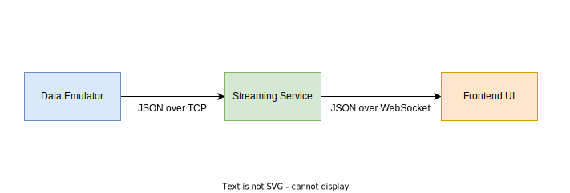

# UNSW Redback Racing - Data Acquisition Team - Technical Assessment

This assessment aims to gauge your current technical ability and give you a practical introduction to some of what we do here at Redback Racing. 
We don't expect everyone to complete everything perfectly - you may not be familiar with all the frameworks and tools mentioned here, and so you may find it helpful to consult the resources linked, as well as doing your own research. 

We also highly encourage you to read through the code and try to understand how it currently works, as well as reading the terminal output of the code once you get it running.

If there is a part you have attempted but cannot complete, then note down your approaches, thoughts and research in the [brainstorming.md](./brainstorming.md) file.

If you have any questions/require clarification about the spec, direct them to the FAQs [page](https://docs.google.com/spreadsheets/d/1vl77OBlmlIJ3QawL0HUdfF573D8-kTrR7Xg4J3lh8Qg/edit?usp=sharing). 

### Submission Date: 05/03/2023

### Submission Instructions:

1. Fork the repository to your own Github account
2. Send us a link to your repository at: https://forms.gle/ksECPdDX6rUixt388

## Live Battery Monitoring System

You are given code for a simple live telemetry application which is able to visualise sensor data streamed over a network - specifically, it is able to visualise the temperature of a Electric Vehicle battery, ensuring that it doesn't get dangerously hot and explode!

It consists of three components:
* **Data Emulator** - this is meant to emulate data coming from the battery temperature sensor. It streams this data over TCP to the backend streaming service.
* **Backend Streaming Service** - this is an application that forwards incoming packets of data to connected frontend clients over the WebSocket protocol.
* **Frontend** - this is the frontend application that will visualise the temperature of the battery.



### Your Tasks

**NOTE: In the `battery_emulator.ts` file, you may change the following constants to change the frequency of data being sent, as well as the chances of generating out-of-range/invalid data, for testing purposes:**

```
const MILLISECONDS = 500;
const ERROR_CHANCE = 15;
```

**You may NOT modify anything else in the `battery_emulator.ts` file**

### Part 1

When running the emulator, the streaming service will occasionally crash. Think about where this crash is happening, and add something to the code to better handle this issue.

NOTE: you may have to run this for up to ~30 seconds before the crash happens.

### Part 2

The battery has a safe operating range of 20 - 80 degrees celcius. 

Add a feature to the backend streaming service so that each time the received battery temperature exceeds this range more than 3 times in 5 seconds, the current timestamp is logged to a file named 'incidents.log'.

### Part 3

The frontend is currently very basic. Extend the frontend by:

* Making the battery temperature value change colours based on the current temperature (e.g. changing to red when the safe temperature range is exceeded).
  
* Making the frontend more aesthetically pleasing, however you see fit.

### Part 4 - EXTENSION TASK

Build a CI/CD pipeline with GitHub Actions which automates:

1. linting

2. unit testing

3. building docker images for each application

4. pushing them to Docker Hub


## Setup Steps

Install Node Version Manager (`nvm`) onto your desired OS (Windows, Mac or Linux) by following this [guide](https://www.freecodecamp.org/news/node-version-manager-nvm-install-guide/): 

**NOTE: for the following steps, anything before the `$>` is just specifying the current directory, and is not part of the command.**

From within the DAQ-Technical-Assessment directory, run the following:

```
DAQ-Technical-Assessment/$> nvm install 18.14.0
DAQ-Technical-Assessment/$> nvm use 18.14.0
DAQ-Technical-Assessment/$> npm install -g typescript
DAQ-Technical-Assessment/$> npm install -g ts-node
```

You are now using Node.js version 18.14.0.

Navigate into each of the directories, `battery-ui/`, `data-emulator/` and `streaming-service/`, and run `npm install` from within each of them:
```
DAQ-Technical-Assessment/battery-ui/$> npm install
DAQ-Technical-Assessment/data-emulator/$> npm install
DAQ-Technical-Assessment/streaming-service/$> npm install
```

To run each of the applications, open three terminals. In each one, navigate to the application folder, and run `npm start`:

**NOTE: The streaming-service must be started before the data emulator. If the streaming service crashes, the data-emulator must be restarted as well**

*Terminal 1*
```
DAQ-Technical-Assessment/battery-ui/$> npm start
```

*Terminal 2*
```
DAQ-Technical-Assessment/streaming-service/$> npm start
```

*Terminal 3*
```
DAQ-Technical-Assessment/data-emulator/$> npm start
```

To see the UI, go to `localhost:3000` in your browser. The live battery value may not update properly until you fix the issue in [Part 1](#part-1). You may also have to refresh the page after restarting the streaming-service.


## Resources 

### Backend 

 - https://nodejs.dev/learn 
 - https://www.typescriptlang.org/docs/handbook/typescript-from-scratch.html 
 - https://www.youtube.com/watch?v=ENrzD9HAZK4 
 - https://www.youtube.com/watch?v=zQnBQ4tB3ZA

### Frontend 

 - https://reactjs.org/ 
 - https://react-typescript-cheatsheet.netlify.app/docs/basic/setup 
 - https://reactjs.org/tutorial/tutorial.html
 - https://www.youtube.com/watch?v=hQAHSlTtcmY 
 - https://www.youtube.com/watch?v=Tn6-PIqc4UM

### Cloud CI/CD

 - https://docs.github.com/en/actions/learn-github-actions/understanding-github-actions
 - https://docs.docker.com/
 - https://www.youtube.com/watch?v=gAkwW2tuIqE


