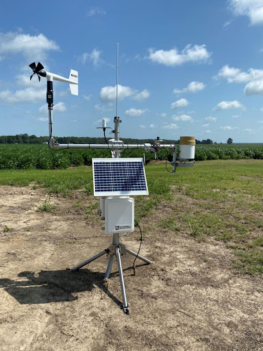
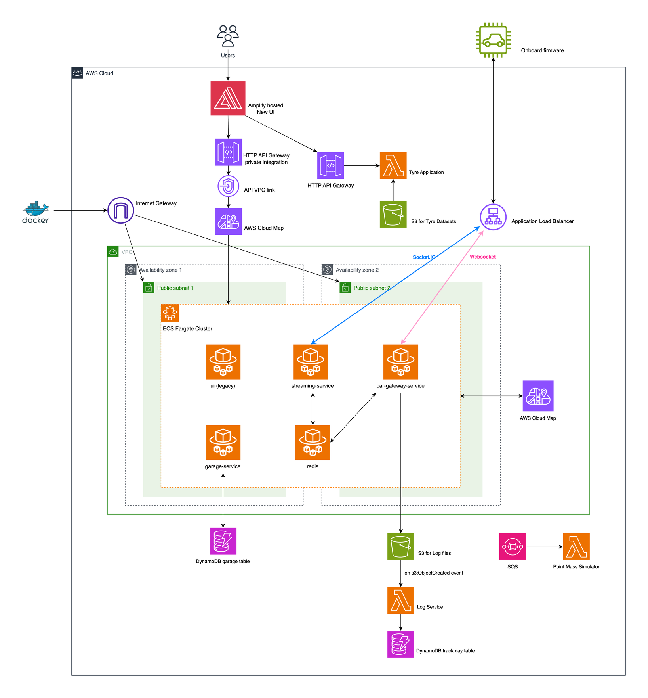
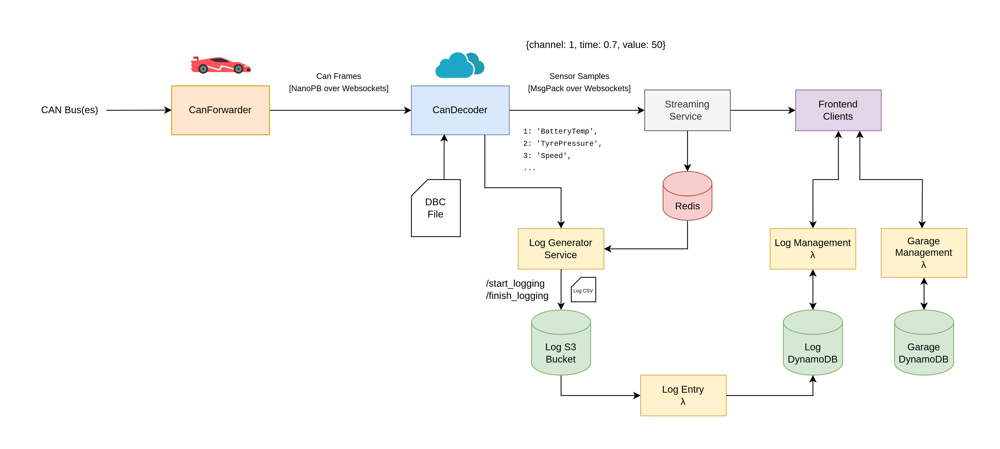

# Cloud Technical Assessment

## Key Concepts

- Design a scalable cloud architecture
- Implement the designed architecture into a cloud platform of your choose
- Justify the design decisions made, including budget, security, performance and scalability

## Resources

This is just a list of resources that are relevant. You don't have to go through all of them.

- [What is DevOps? REALLY understand it | DevOps vs SRE](https://www.youtube.com/watch?v=0yWAtQ6wYNM)
- [What is GitOps, How GitOps works and Why it's so useful](https://www.youtube.com/watch?v=f5EpcWp0THw)
- [DevOps CI/CD Explained in 100 Seconds](https://www.youtube.com/watch?v=scEDHsr3APg)
- [Containers on AWS Overview: ECS | EKS | Fargate | ECR](https://www.youtube.com/watch?v=AYAh6YDXuho&pp=ygUPYXdzIGVjcyBmYXJnYXRl)
- [What is Infrastructure as Code? Difference of Infrastructure as Code Tools](https://www.youtube.com/watch?v=POPP2WTJ8es)
- [Terraform Tutorial for Beginners + Labs: Complete Step by Step Guide!](https://www.youtube.com/watch?v=YcJ9IeukJL)
- [Terraform](https://www.terraform.io/)
- [Redis](https://redis.io/docs/management/persistence/)
- [Serverless Terraform](https://www.serverless.com//blog/definitive-guide-terraform-serverless)
- [AWS ECS](https://aws.amazon.com/ecs/)

## Tasks

DAQ wants to implement a local weather station collection system as the race engineers want to correlate local weather data with vehicle performance. DAQ currently uses Amazon Web Services (AWS) to deploy and run their systems.

The weather station will be set up on trackdays to monitor temperature, air, humidity, track temperature, wind, and wind direction. It will be offboard the car rather than on the car and so requires it's own solution to connect with the AWS Cloud streaming service.

Below is the current Cloud Architectural diagram for Redback Racing:

Investigate and propose a change or addition that would allow data to be integrated into the Redback Cloud System. You are expected to submit a **PDF document** which includes an architecture diagram showing what the system would look like and how you would implement it. You may edit the [cloud_diagram](./cloud_diagram.drawio) file (use [draw.io](https://app.diagrams.net/)) with your changes or create a new diagram. Be prepared to explain your implementation.

**You do not have to implement this system however you may provide code samples (IaC) where you see fit.**

## Considerations

- This is a **free-form assessment**. You can implement the cloud solutions to this problem in anyway that you see fit including adjusting the diagram above.
- You can design the weather station to transmit data in any protocol you see fit.
- You are allowed to adapt current ECS clusters to suit a solution or you can create a new service.
  - eg. streaming-service
- `Onboard Firmware` currently connects to the `streaming-service` via websocket
- Redback uses Terraform (Infrastructure as Code (IaC)) to deploy their systems. Write about how you would use Terraform to deploy the services required for the weather station.
- Redback uses Docker to containerise applications. Consider how Docker can be implemented for the cloud ECS and potentially onboard firmware on the weather station.
- Consider where weather station data can be stored.
  - Currently, log files in the car are stored in S3 Buckets

## Appendix

The diagram below shows a software system for how data gets from the car to the cloud. You can use this as a reference for how you would like to implement your system.

