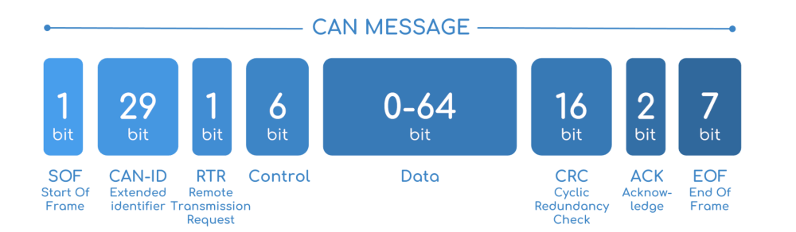
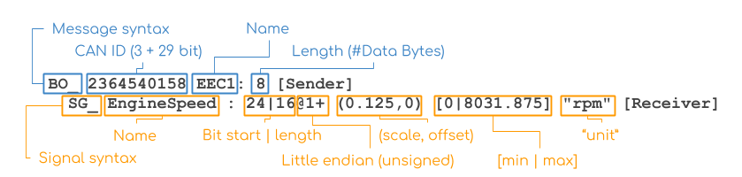

# Firmware

### CAN & CANBUS

#### What is it?

CAN (Controller Area Network) is a vehicle bus standard designed to relay data between microcontrollers. This standard is typically used in the automotive industry and is adopted by Redback.

A CANBUS is the network in which CAN data is sent through.

A single can packet is known as a CAN frame and consists of up to a 64 bit data payload. Below is a breakdown of a CAN frame. It is worth noting that there are two main types of CAN. CAN and CAN FD. CAN will only have a 11 bit CAN ID where as CAN FD can support up to a 29 bit CAN ID. The diagram below shows the frame breakdown of a CAN frame.

Below is the breakdown of a CAN FD frame.

### DBC

#### What is it?

Given the above explanation, it's quite clear that presenting raw binary as a means of displaying sensor values is not quite intuitive. For this reason, DBC files exist. A DBC file is a text file which defines how a CAN frame can be broken down into one or multiple sensors. Since a CAN frame can allocate up to 64 bits towards data, hypothetically, you could fit 64 sensors where each holds 1 bit of data into the 64 bit data payload. In this circumstance, the DBC file defines where each of the 64 sensor values lies within the 64 bit allocation.

For example:

- Sensor A starts at bit `0` of the 64 bit data sequence and has a length of 1 bit.
- Sensor B starts at bit `1` of the 64 bit data sequence and has a length of 1 bit.
- Sensor C starts at bit `2` of the 64 bit data sequence and has a length of 1 bit.
- and so on...

These sensor definitions allows the raw CAN data to be interpreted into human friendly values by masking out the correct sequence of bits.

As shown in the above diagram, it's worth noting that:

- Each CAN Frame is defined by `BO`
  - Each sensor within that CAN frame is listed under the CAN frame prefixed with `SG_`
- The CAN Frame ID is defined in decimal as `2364540158` and is unique within the DBC file.
  - This CAN Frame holds 1 sensor `EngineSpeed` which starts at bit 24 of the 64 bit data payload and has a length of 16 bits.
- `@1` indicates that these bits are of little endianess and the `+` indicates it is unsigned.
  - Conversely, `@0` would indicate big endianess and a `-` would indicates it is signed.
- The scale is a multiplier applied to the decimal interpretation of the masked bits to acquire the correct sensor value.
- `0|8031.875` is metadata used to indicate the valid range for this sensor
- `rpm` is metadata used to indicate the valid unit for this sensor

## Resources

### CAN/DBC

- https://www.csselectronics.com/pages/can-dbc-file-database-intro

## Tasks

You are provided with two files.

- `dump.log`
  - This file is a log of all the sensor outputs from our car. Our car utilises a protocol called CAN
- `SensorBus.dbc`
  - This file defines the CAN definitions for the can log file above.
