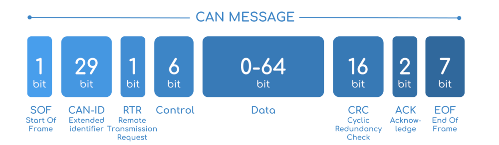

# Firmware

### CAN & CANBUS

#### What is it?

CAN (Controller Area Network) is a vehicle bus standard designed to relay data between microcontrollers. This standard is typically used in the automotive industry and is adopted by Redback.

A CANBUS is the network in which CAN data is sent through.

A single can packet is known as a CAN frame and consists of a 64 bit sequence. Below is a breakdown of a CAN frame.

### DBC

#### What is it?

A DBC file is a text file which allows the raw CAN data to be interpreted into human friendly values.

You are provided with two files.

- dump.log
  - This file is a log of all the sensor outputs from our car. Our car utilises a protocol called CAN
- SensorBus.dbc
  - This file defines the CAN definitions for the can log file above.

## Tasks
