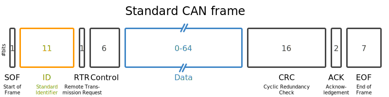
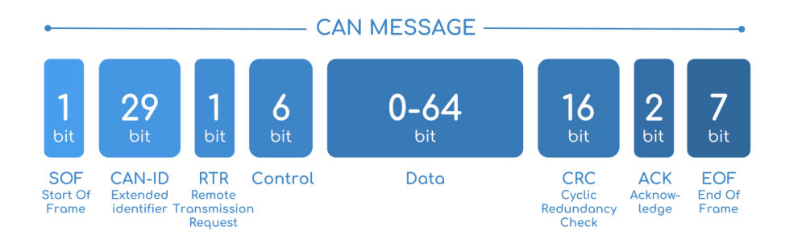

# Firmware

### Key Concepts

- Controller Area Network (CAN)
- Can Frames
- Can Bus
- What is a DBC file?
- Bitwise manipulations

## CAN & CANBUS

### CAN Basics

Similar to HTTP, USB or other communication methods over wires, CAN is a communication standard that works to asyncronously connect the sensors of a vehicle to each other and a central computer (ECU).

CAN is used in various applications such as automotive vehicles, farming machinery and even some aviation applications due to the robustness of the standard.

#### Key points

- A CAN packet is known as a CAN frame and all CAN frames have a 64 bit data payload, although not all 64 bits have to be used
- Each CAN frame is split into signals (sensor definitions)
- Can Frames are defined by a DBC file
- A CAN Bus is a network in which CAN data is sent through.
- There are two main types of CAN. CAN and CAN FD. CAN will only have a 11 bit CAN ID where as CAN FD can support up to a 29 bit CAN ID.

The diagram below shows the breakdown of a CAN frame.



Below is the breakdown of a CAN FD frame.


## DBC

### What is it?

A DBC file is a text file which defines how a CAN frame can be broken down into one or multiple signals.


As shown in the above diagram, it's worth noting that:

- Generally, each CAN Frame is defined by `BO`
  - Each signal within that CAN frame is listed under the CAN frame prefixed with `SG_`
- The CAN Frame ID is defined in decimal as `2364540158` and is unique within the DBC file.
  - This CAN Frame holds 1 sensor `EngineSpeed` which starts at bit 24 of the 64 bit data payload and has a length of 16 bits.
- `@1` indicates that these bits are of little endianess and the `+` indicates it is unsigned.
  - Conversely, `@0` would indicate big endianess and a `-` would indicates it is signed.
- The scale is a multiplier applied to the decimal interpretation of the masked bits to acquire the correct sensor value.
- `0|8031.875` is metadata used to indicate the valid range for this sensor
- `rpm` is metadata used to indicate the valid unit for this sensor

Applying this to another example:

```
 BO_ 1697 Example_Sensors: 8 Vector__XXX
    SG_ SensorD : 48|16@1- (0.1,0) [0|0] "Degrees Celsius" Vector__XXX
    SG_ SensorC : 32|16@1- (0.1,0) [0|0] "Degrees Celsius" Vector__XXX
    SG_ SensorB : 16|16@1- (0.1,0) [0|0] "Degrees Celsius" Vector__XXX
    SG_ SensorA : 0|16@1- (0.1,0) [0|0] "Degrees Celsius" Vector__XXX
```

- SensorA starts at bit `0` of the 64 bit data sequence and has a length of 16 bits.
- SensorB starts at bit `16` of the 64 bit data sequence and has a length of 16 bits.
- SensorC starts at bit `32` of the 64 bit data sequence and has a length of 16 bits.
- SensorD starts at bit `32` of the 64 bit data sequence and has a length of 16 bits.

These sensor definitions allows the raw CAN data to be interpreted into human friendly values by masking out the correct sequence of bits.

## Resources

### CAN/DBC

- https://www.csselectronics.com/pages/can-dbc-file-database-intro
- https://github.com/xR3b0rn/dbcppp
- https://github.com/linux-can/can-utils

## Tasks

You are provided with two files.

- `dump.log`

  - This file is a 'CAN dump' of data from our car. It is generated by the `cangen` command on linux can-utils.

  - It is in the format of:

  ```
  timestamp           interface   id#data_payload
  (1705638799.992057) vcan0       705#B1B8E3680F488B72
  ```

  - Note that the CAN ID here is in hexadecimal. The DBC Files say the id in decimal format instead.

- `SensorBus.dbc`
  - This file defines the CAN definitions for the can log file above. It is written by DAQ and is a slimmed down version from what we use on RB23. Additionally, the DBC file provided here only defines one CAN frame. `ECU_WheelSpeed`.

### Stage 1

Given the definitions in `SensorBus.dbc`, parse the `dump.log` file to extract the `WheelSpeedFR` value and `WheelSpeedRR` values.

**Generate your output into a file named `output.txt`.**

#### Task Breakdown:

1. Extract the unix time, frame ID and databytes from `dump.log`.
2. Manipulate the data bytes such that you receive the correct output. Remember to consider the defined:
   - Start bit.
   - Bit length.
   - Byte Order Endianess.
   - Conversion factor.
3. Generate your output to a file called `output.txt`. Ensure it matches the convention below.

#### Expected Format/Output

Your output format should include the UNIX timestamp (in seconds) when the sensor emitted data, the sensor name and the decoded value in that order. The delimiter must be a `:`. The first three lines of the expected output is defined below:

```
(1705638753.913408): WheelSpeedFR: 4972.1
(1705638753.913408): WheelSpeedRR: 4546.1
(1705638754.915609): WheelSpeedFR: 4646.0
```

If the first three lines of your output matches the three lines above, great! You are on the right track. Of course, your output will be much larger than what we've provided above. **Note that the formatting of your output must strictly match the formatting defined above to pass auto-tests however, we will be manually marking where applicable.**

- A C++ implementation is highly preferable however you may use any language you'd like.
- You are allowed to use libraries to aid your implementation or implement your own method to parse.
- If you have any questions feel free to ask in the Redback Discord.

<details>
  <summary><b><i>Extra Hints</i></b></summary>
  
  - You are allowed to use ChatGPT but please mention it's usage in the `brainstorming.md`. ChatGPT may hallucinate correct code however. Becareful and understand the DBC spec.
  
  - You only have to consider the cases above. Your code does not have to cover all parsing cases of CAN. However if you use a CAN parsing library, that will cover all use cases.
  
  - You are allowed to hardcode "bitmasks" and bitshift manually if you see fit

</details>

### Stage 2

Answer theoretical questions about CAN hardware and Software in `answer.txt`.

1. What are advantages and disadvantages of CAN over other protocols such as USB, PCIE, SPI etc? List reasons of why Redback Racing's Embedded Systems, Powertrain, DAQ and Autonomous Vehicles(AV) departments would use CAN?
   Hint: CAN has a lot of desirable properties
