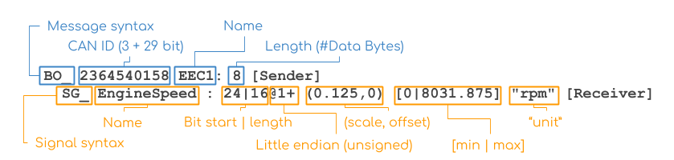

# Firmware

### Key Concepts

- Controller Area Network (CAN)
- Can Frames
- Can Bus
- What is a DBC file?
- Bitwise manipulations

## Introduction to CAN Bus and CAN Frames

### CAN Basics

Similar to HTTP, USB or other communication methods over wires, CAN is a communication standard that works to asyncronously connect the sensors of a vehicle to each other and a central computer (ECU).

CAN is used in various applications such as automotive vehicles, farming machinery and even some aviation applications due to the robustness of the standard.

#### Key points

- A CAN packet is known as a CAN frame and all CAN frames have a 64 bit data payload, although not all 64 bits have to be used
- Each CAN frame is split into signals (sensor definitions)
- Can Frames are defined by a DBC file
- There are two main types of CAN. CAN (standard) and CAN FD (extended). CAN (standard) will only have a 11 bit CAN ID whereas CAN FD (extended) supports up to a 29 bit CAN ID.

The diagram below shows the breakdown of a CAN frame.


Below is the breakdown of a CAN FD frame.


## DBC

### What is it?

DBC files are text files which define the structure of CAN frames. They can be used to encode the data into a CAN frame or decode the data from a frame.



As shown in the above diagram, it's worth noting that:

- Generally, each CAN Frame is defined by `BO`
  - Each signal within that CAN frame is listed under the CAN frame prefixed with `SG_`
- In the above example, the CAN Frame ID is defined in decimal as `2364540158` and is unique within the DBC file.
  - This CAN Frame holds 1 sensor `EngineSpeed` which starts at bit 24 of the 64 bit data payload and has a length of 16 bits.
- `@1` indicates that these bits are of little endianess and the `+` indicates it is unsigned.
  - Conversely, `@0` would indicate big endianess and a `-` would indicates it is signed.
- The scale is a multiplier applied to the decimal interpretation of the masked bits to acquire the correct sensor value.
- `0|8031.875` is metadata used to indicate the valid range for this sensor
- `rpm` is metadata used to indicate the valid unit for this sensor

Applying this to another example:

```
 BO_ 1697 Example_Sensors: 8 Vector__XXX
    SG_ SensorD : 48|16@1- (0.1,0) [0|0] "Degrees Celsius" Vector__XXX
    SG_ SensorC : 32|16@1- (0.1,0) [0|0] "Degrees Celsius" Vector__XXX
    SG_ SensorB : 16|16@1- (0.1,0) [0|0] "Degrees Celsius" Vector__XXX
    SG_ SensorA : 0|16@1- (0.1,0) [0|0] "Degrees Celsius" Vector__XXX
```

- SensorA starts at bit `0` of the 64 bit data sequence and has a length of 16 bits.
- SensorB starts at bit `16` of the 64 bit data sequence and has a length of 16 bits.
- SensorC starts at bit `32` of the 64 bit data sequence and has a length of 16 bits.
- SensorD starts at bit `48` of the 64 bit data sequence and has a length of 16 bits.

These sensor definitions allows the raw CAN data to be interpreted into human friendly values by masking out the correct sequence of bits.

## Resources

### CAN/DBC

- https://www.csselectronics.com/pages/can-dbc-file-database-intro
- https://github.com/xR3b0rn/dbcppp
- https://github.com/linux-can/can-utils

## Tasks

You are provided with **four** files:

- `dump.log`
  - A **CAN dump** file containing CAN data.
  - This log file was generated using the `cangen` command from [can-utils](https://github.com/linux-can/can-utils).
  - Format:
    ```
    timestamp           interface   id#data_payload
    (1705638799.992057) vcan0       705#B1B8E3680F488B72
    ```
  - The **CAN ID** is in **hexadecimal**; however, **DBC files use decimal format**.

- `ControlBus.dbc` for **can0**

- `SensorBus.dbc`  for **can1**

- `TractiveBus.dbc` for **can2**

---

### **Stage 1: CAN Data Parsing**

Using **dbcppp** (a DBC file parsing library), parse the `dump.log` file and extract **all** sensor values defined in `SensorBus.dbc`, `TractiveBus.dbc`, and `ControlBus.dbc`.

**Your solution must use `dbcppp` for parsing the DBC files. Manually writing your own parsing logic is not allowed as it will be tested in a later stage.**

#### **Task Breakdown:**
1. Setup **dbcppp** in your project. General steps:
     - Adding the library as a submodule 
     - Modify `CMakeLists.txt` to link library
     - Update Docker Instructions to support dbcppp
2. Extract the **timestamp**, **frame ID**, and **data bytes** from `dump.log`.
3. Use **dbcppp** to parse the three DBC files.
4. Decode all CAN frames from `dump.log` according to their corresponding DBC definitions to the correct output. Remember that each interface has its own respective DBC file.
5. Generate your output to a file called **`output.txt`**. Ensure it matches the convention below.


#### Expected Format/Output 
Your output format should include the UNIX timestamp (in seconds) when the sensor emitted data, the sensor name and the decoded value in that order. The delimiter must be a `:`. The first few lines of the expected output is defined below:

```
(1730892639.316946): CoolantPressureFanOUT: -1724.5
(1730892639.316946): CoolantPressureFanIN: -3276.8
(1730892639.316946): CoolantInverterPressure: 3276.7
(1730892639.317588): Pack_Current: 0
(1730892639.317588): Pack_Inst_Voltage: 485.3
(1730892639.317588): Pack_SOC: 14.5
(1730892639.317588): Relay_State: 30793
(1730892639.317234): Speed_actual: 0
(1730892639.317234): Speed_target: 0
(1730892639.317234): Steering_angle_actual: -1.5
(1730892639.317234): Steering_angle_target: 0
(1730892639.317234): Brake_hydr_actual: 255
(1730892639.317234): Brake_hydr_target: 0
(1730892639.317234): Motor_moment_actual: 0
(1730892639.317234): Motor_moment_target: 0
```

If the first few lines of your output matches the lines above, great! You are on the right track. Of course, your output will be much larger than what we've provided above. **Note that the formatting of your output must strictly match the formatting defined above to pass auto-tests however, we will be manually marking where applicable.**

## **Project Setup / Requirements**

A `Dockerfile`, `main.cpp`, and `CMakeLists.txt` have been provided in the `solution/` directory.

- Your solution **must be implemented inside a Docker environment** to ensure compatibility across devices. Update `Dockerfile` as necessary.
- You can add additional files as needed, but main.cpp will be the entry point where the code is executed.
- Ensure **`output.txt`**  is not just inside the Docker container but is also available in the repository when submitting.
  - Can be done with  **docker cp** or by mounting a volume
- Using classes is highly recommended for later stages (unit testing) 


### Cmake
- A basic **CMake** setup is provided to assist in building the solution. Update as neccessary.
  - **CMake is highly recommended** for better build management.  
  - To build using CMake:
    ```
    cd build
    cmake ..
    make -j
    ```
### Docker Container 
#### Setup Instructions (For Unix-based Systems)
In one terminal, run

```
docker compose up
```

In another terminal, run docker ps to get the name of the running container, and then

```
sudo docker exec -it {container-name} bash
```

to enter it.

#### Entrypoint 

In the `Dockerfile` You can use
```
ENTRYPOINT ["./build/solution/answer"]
```
instead of, 
```
ENTRYPOINT ["bash"]    
```
to execute `main.cpp` when container runs.

#### Rebuild
When you modify code, you should run

```
docker compose up --build
```
to rebuild the docker image
unless you are using volumes (can be set in docker-compose.yml). 

#### For Windows Users
For the easiest setup on Windows, use Windows Subsystem for Linux (WSL) with Docker Desktop.
1. Install WSL and set up a Linux distribution (Ubuntu recommended)
2. Ensure Docker Desktop is installed and configured to use WSL
3. Follow the same Unix setup instructions within your WSL terminal
---

### Important Notes
  
  - You are allowed to use ChatGPT but please mention it's usage in the `brainstorming.md`. ChatGPT may hallucinate correct code however. Be careful and understand the DBC spec.
  - Be aware that multiple DBC files **may define the same CAN ID**, so handle this case correctly.
  - **Feel free to ask any questions in the Redback Discord! Ask much as you need.**

## Stage 2

Answer the following theoretical questions in `answer.txt`.

### CAN 

1. What are the advantages and disadvantages of the CAN protocol compared to other protocols such as USB, PCIE, SPI etc? 

2. Why would Redback Racing's Embedded Systems, Powertrain, DAQ (Data Acquisition), and Autonomous Vehicles (AV) departments specifically choose CAN over other protocols? 
### STM32 Chip Selection
 STM32 is a family of widely used MCUs, that can be programmed in **C**, similar to an Arduino. 
 For this year's DAQ firmware, we are using STM32-based computing for our hardware. A critical design step in any production process is selecting the appropriate **STM32 chip** that meets the project's requirements. More information on STM32 MCUs can be found [here](https://www.st.com/en/microcontrollers-microprocessors/stm32-32-bit-arm-cortex-mcus.html).  

### Task
- Using [STM32 MCU product selector](https://www.st.com/content/st_com/en/stm32-mcu-product-selector.html), find a chip with: 
  1. 3 CAN buses
  2. ethernet support
  3. at least 3 A/D converters
  4. USB support
  5. 12 16bit timers
  6. flash size of 2048kB

* Which STM32 chip have you selected? **Provide justification** for your selection.
  - Does this chip exceed the minimum requirements, or does it just meet them?
  - What are its power requirements?  
  - What are its physical dimensions?  
  - What is the cost of the chip?  
  - **(Optional)** If you have experience with STM32 chips, would you modify any of the given requirements?  

## **Stage 3: Implement Unit Tests**

To ensure your solution is robust, you must implement **unit tests**.

### **Requirements:**
- Choose a **C++ testing framework**. For example:
  - [Catch2](https://github.com/catchorg/Catch2)
- Your unit tests should aim to verify:
  1. Correct parsing of CAN frames
  2. Proper extraction of sensor values
  3. Handling of multiple DBC files defining the same CAN ID
  4. Endianess, bit-length, and scaling calculations
  5. Error handling for invalid log entries
- Place your test files inside a **`tests/`** directory.
- Tests should be able to run inside the **Docker environment**.
- Provide instructions on how to run tests in `brainstorming.md`


## **(Advanced) Stage 4: Implement Your Own DBC Parser and Decoder**

For this stage, you must implement **your own solution** to parse **DBC files** and decode CAN frames without using `dbcppp`.

### **Requirements:**
- Implement a **DBC file parser** from scratch.
- Implement **CAN frame decoding logic** including:
  - Extracting **start bit** and **bit length**.
  - Handling **big-endian and little-endian** formats.
  - Applying **scaling factors**.
- Your output format should **match Stage 1**.
- Provide instructions on how to run  your solution in `brainstorming.md`

This will test your **understanding of bitwise operations** and **CAN frame decoding**.

---