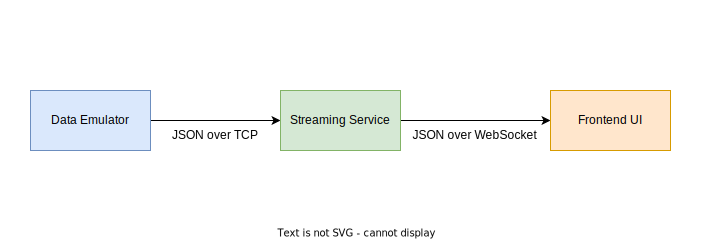

# Telemetry System

You are given code for a simple live telemetry application which is able to visualise sensor data streamed over a network - specifically, it is able to visualise the temperature of a Electric Vehicle battery, ensuring that it doesn't get dangerously hot and explode!

It consists of three components:

- **Data Emulator** - this is an emulator designed to generate data which appears to come from a battery temperature sensor. It streams this data over TCP to the backend streaming service.

- **Streaming Service** - this is an application that simultaneously receives a connection from the data emulator and forwards incoming packets of data to connected frontend clients over the WebSocket protocol.

- **Frontend** - this is a ReactJS based frontend application that you will manipulate/design to visualise the temperature of the battery.

  

## Resources

### Backend

- https://nodejs.dev/learn
- https://www.typescriptlang.org/docs/handbook/typescript-from-scratch.html
- https://www.youtube.com/watch?v=ENrzD9HAZK4
- https://www.youtube.com/watch?v=zQnBQ4tB3ZA

### Frontend

- https://reactjs.org/
- https://react-typescript-cheatsheet.netlify.app/docs/basic/setup
- https://reactjs.org/tutorial/tutorial.html
- https://www.youtube.com/watch?v=hQAHSlTtcmY
- https://www.youtube.com/watch?v=Tn6-PIqc4UM

## Setup

**This step is optional but recommended.**

Although Docker is used to run the telemetry services for ease of development, when developing the codebase locally within an IDE, you may find that static analysis tools will not be available. To resolve this, you have to install the project node packages locally so that your IDE can analyse your code correctly. If this doesn't significantly impact your development, you may skip this step.

To do this:

- Install [Node Version Manager](https://github.com/nvm-sh/nvm?tab=readme-ov-file#installing-and-updating) (`nvm`)

- Install and use Node v18.14.0 via `nvm`

  ```bash
  nvm install 18.14.0   # installs Node v18.14.0
  nvm use 18.14.0       # selects Node v18.14.0 for use
  ```

- Install node packages for `data-emulator/`
  ```bash
  cd data-emulator; npm install
  ```
- Install node packages for `streaming-service/`
  ```bash
  cd streaming-service; npm install
  ```
- Install node packages for `ui/`

  ```bash
  cd ui; npm install
  ```

  Static analysis tools should work now given the above steps. To run the system as a whole, open a terminal within the `telemetry/` directory and execute `docker compose up`.

## Tasks

**You may NOT modify anything in the `data-emulator/` directory for any given task**

1. When running the emulator, the streaming service will occasionally crash. Think about where and why this crash is happening, and add something to the code to better handle this issue.

   - You may have to run this for up to ~30 seconds before the crash happens

2. A safe operating range for the battery temperature is 20-80 degrees. Add a feature to the backend `streaming-service` so that each time the received battery temperature exceeds this range more than 3 times in 5 seconds, the current timestamp and a simple error message is printed to console.

3. The ReactJS frontend is currently very basic. Extend the frontend by:

- Making the battery temperature value change colours based on the current temperature (e.g. changing to red when the safe temperature range is exceeded).
  - Safe operating ranges are defined below
    | Range | Colour |
    |---------------------------------|--------|
    | Safe (20-80) | Green |
    | Nearing unsafe (20-25 or 75-80) | Yellow |
    | Unsafe (<20 or >80) | Red |
- Making the frontend more aesthetically pleasing, however you see fit.

To start the telemetry system:

```bash
cd DAQ-Technical-Assessment/telemetry
docker compose up
```

To see the UI, go to [http://localhost:3000](http://localhost:3000) in your browser.
